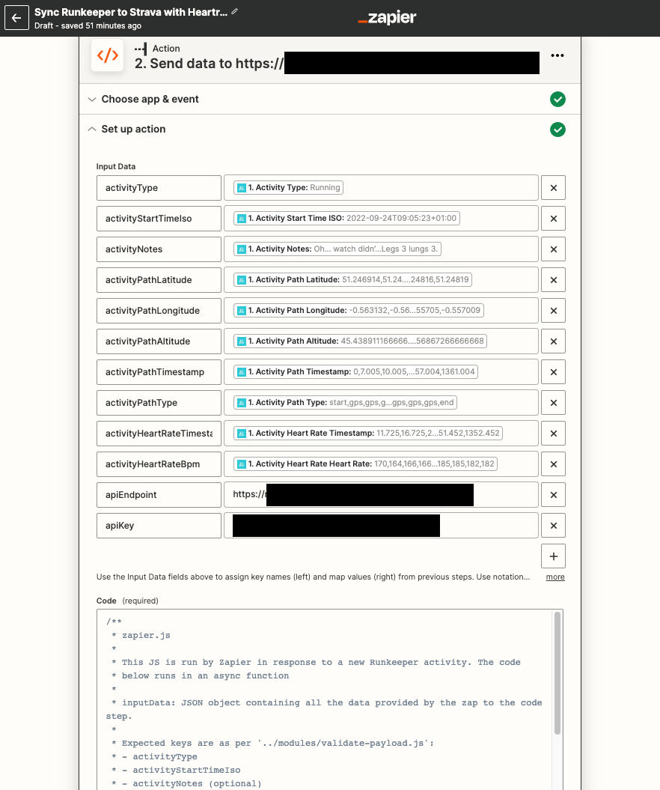

# runkeeper-strava-sync
**These scripts are designed to receive GPS data about individual exercise activities from [Runkeeper](https://runkeeper.com/), convert it to [GPX](https://www.topografix.com/GPX/1/1/) format, then upload it to [Strava](https://strava.com) as a new activity.**

## Overview
Running in a NodeJS environment, an Express server is set up to listen for incoming requests over http. The app contains an authentication view where the user can authorise the app to send activities to the Strava account of their choice.

An external service (in this case, [Zapier](https://zapier.com)) receives Webhook notifications when a new activity is recorded in Runkeeper.

Zapier then executes a script which sends `post` request with a payload of data to this app. The Zapier script ([/external/zapier.js](external/zapier.js)) uses `fetch` to send a payload of JSON to the express server.

The server saves the JSON locally, queues a function to process the data, then responds to Zapier with a relevant status code.

Seconds later, the queued function executes, converting the JSON data to a valid GPX file, then sending it to the authenticated Strava account, creating a new activity in Strava.

You can read more detail about the thinking behind the app on [my blog](https://www.andrewchart.co.uk/blog/web/development/how-to-sync-runkeeper-strava).

## Setup

### Strava

1. Within your Strava account, [create a new API application](https://developers.strava.com/docs/getting-started/#account).
2. Ensure the **Callback Domain** is set to the domain that you intend to host the _runkeeper-strava-sync_ app on.
3. Take a note of the **Client ID** and **Client Secret**. These will be used in the app's `.env` file.

### This App

1. Run `npm install`.
2. Specify the environment variables in a `.env` file in the root folder (see [Environment Variables](#environment-variables)).
3. Run `npm start`.

_This app can easily be deployed to an app service environment like Azure App Service or Heroku._

### Zapier

1. Under _Apps_, create a **new connection** to Runkeeper
2. Authenticate your Runkeeper account, allowing Zapier to listen for new activities
3. Create a new **Zap** with _New Activity in Runkeeper_ as the trigger, and a _Code By Zapier_ action step
4. Set up the zap to pass the Runkeeper Data into the code step as variables.
   - Each data is passed as a key in an object called `inputData`.
   - See [modules/validate-payload.js](modules/validate-payload.js) for the expected keys. These are camelCased versions of what Zapier calls the data coming from Runkeeper.
   - The screenshot below should give you an idea of how this should look when finished.
5. Additionally, specify the `API_KEY` from `.env` and the url where you hosted this app as `apiKey` and `apiEndpoint` respectively.
6. Set up the code step to run the script in [external/zapier.js](external/zapier.js) and turn on the zap.

_Once you're done, the Zap should look something like this:_

## Usage
Once the app is running, to use the app, you must first authenticate a single Strava account. Visit the url, `/strava-auth` to do this, then enter your `API_KEY` string. Protecting the OAuth process using the app's key in this way means that the public cannot control which Strava account is authenticated for use by your instance of the app.

Once a Strava account is authenticated, Zapier should be able to send the data in a `post` request to the root url (`/`). The expected payload is described in [json/example.json](json/example.json) and [modules/validate-payload.js](modules/validate-payload.js). Again, this must be accompanied by the key (specified in the Zapier step above) to work.

With the Zap on, you should find that a new Runkeeper actvity triggers the zap, sends the data to this app, and results in a new activity being created in the authenticated Strava account.

---

## Application Details

### Environment Variables

| process.ENV Variable | Description                                                                                        |
|----------------------|----------------------------------------------------------------------------------------------------|
| PORT                 | The port to run the application on. Defaults to 3000 if not specified.                             |
| API_KEY              | A random, long string of your choosing, used as a password to keep the application private to you. |
| STRAVA_CLIENT_ID     | An integer which is given to you when you create an API application within your Strava account.    |
| STRAVA_CLIENT_SECRET | The string which is given to you as a secret key, associated with the Strava app you created.      |

### Folder Structure
_The following describes the folder structure of this application:_

    .
    ├── external               # Related scripts which run outside of the main app
    ├── gpx                    # GPX files are created here before sending to Strava
    ├── json                   # JSON files are created here when the app receives valid data
    ├── logs                   # Errors are recorded here to help troubleshoot failed processing
    ├── modules                # The main scripts and functions used by the app to process the data
    ├── strava                 # Credentials data store for the currently-authenticated Strava user
    ├── views                  # EJS template files for the Strava Authentication views
    ├── .env.example           # Example of a valid .env file
    ├── .gitignore
    ├── index.js               # App entry point and Express server code.
    ├── package-lock.json
    ├── package.json
    ├── LICENSE
    └── README.md

### External Ping App
Within the repo there is an example of an external script which can be run to "ping" the main app. The purpose of this is to keep the app "awake" when it is hosted in a volatile environment.

I personally set this app up on a free instance on Microsoft Azure App Service, and also using a free-tier Zapier account, which has a code runtime limit of just 1000ms.

Since the app is only used 1-2 times per day maximum, in order to ensure the app always responds quickly enough to Zapier whenever I record a new exercise activity, I set up this script to occasionally "ping" the app to keep it in memory at Azure, and keep the response time low.

The script [external/runkeeper-strava-sync.js](external/runkeeper-strava-sync.js) is an example of how this "ping" can be automated using a cron job in a serverless code environment. In my case I've used Azure Functions to run this script.
